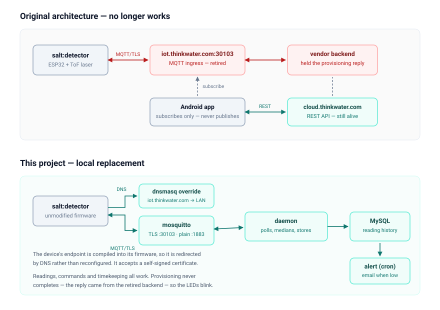

# salt-detector

Local monitoring for a Think:Water **salt:detector** — a time-of-flight salt
level sensor for water softener brine tanks.


The manufacturer was acquired by Culligan and the device backend at
`iot.thinkwater.com:30103` was retired. That hostname now serves a Culligan One
web dashboard on Azure App Service, which cannot host the raw TCP listener the
firmware expects; ports 80 and 443 answer, 30103 is silently dropped. Deployed
units provision over Bluetooth, join wifi, obtain a DHCP lease, then retry TCP
forever and never finish setup. The vendor app is permanently unusable with
this hardware revision.

This project points the device at a local MQTT broker instead and speaks its
protocol directly. No cloud, no vendor dependency.



## How it works

The firmware has `iot.thinkwater.com` compiled in, so redirect it with a DNS
override on the gateway:

```
# /etc/dnsmasq.d/salt-detector.conf
address=/iot.thinkwater.com/192.168.10.10
```

The device speaks MQTT 3.1.1 over TLS on port 30103, with credentials hardcoded
in firmware, and does **not** validate the server certificate — a self-signed
one is accepted:

```
# /etc/mosquitto/conf.d/salt-detector.conf
listener 30103 192.168.10.10
certfile /etc/mosquitto/certs/salt-detector-cert.pem
keyfile  /etc/mosquitto/certs/salt-detector-key.pem
tls_version tlsv1.2
```

Generate the certificate with a backdated validity, since the device clock
starts at 1970 and a certificate issued "in the future" may be refused:

```sh
faketime '1970-01-02 00:00:00' openssl req -x509 -newkey rsa:2048 \
  -keyout salt-detector-key.pem -out salt-detector-cert.pem -nodes -days 36500 \
  -subj "/CN=iot.thinkwater.com" \
  -addext "subjectAltName=DNS:iot.thinkwater.com"
```

Keep a separate plaintext listener for local tooling:

```
listener 1883 127.0.0.1
```

## Protocol

The device id is its MAC with colons removed, grouped in fours
(`e0:e2:e6:6c:xx:xx` becomes `e0e2-e66c-xxxx`). Command payloads are bare
scalars unless noted.

| Publish to | Payload | Device replies on |
|---|---|---|
| `device/update/telemetry/<id>` | `1` | `device/telemetry` |
| `device/update/level/<id>` | `1` | `device/telemetry` |
| `device/info/request/<id>` | `1` | `device/info` |
| `device/update/timestamp/<id>` | `{"timestamp":"YYYY-MM-DD HH:MM:SS"}` | — |
| `device/admin/reset/<id>` | `1` | `device/hardware/reset`, wipes wifi |

Telemetry reply:

```json
{"device_id":"e0e2-e66c-xxxx","level":129,
 "timestamp":"2026-08-01 19:47:22","meas_type":0}
```

The device also subscribes to `device/auto/tinhigh/<id>`,
`device/update/capacity/<id>`, `device/ota/request/<id>` and
`device/feedback/<id>`. No payload format has been found for any of them. APK
analysis (below) shows these were all driven by the vendor backend, not by the
app, so the formats are not recoverable from the client — and UART analysis
(further below) shows why no format will ever work on `device/feedback/<id>`
specifically.

Command payloads on the working topics are **bare scalars**, not JSON — `1` on
`device/admin/reset/<id>` triggers a real factory reset. The exception is
`device/update/timestamp/<id>`, which wants a JSON object; a bare scalar there
reboots the device.

### Things that will bite you

- `level` is a **raw distance in millimetres**, not a percentage. The
  percentage the vendor app showed was computed server-side, which is why this
  project does the conversion itself from two calibration points.
- `level: 0` means **no valid target**, not an empty tank. Daylight defeats the
  sensor past roughly 500 mm; it cannot resolve closer than about 50 mm. Inside
  a closed brine container neither limit tends to matter.
- Consecutive readings vary by tens of millimetres. Take a median.
- The device clock **resets to 1970 on every reboot**. Push the time each run.
- The timestamp topic wants a JSON object. A bare string **reboots the device**.
- Never publish a **retained** message to `device/feedback/<id>`, ever,
  including to clear it: the firmware crashes on any message to that topic
  (confirmed by UART, see below), and a retained one replays on every
  reconnect, producing an endless bootloop indistinguishable from a hardware
  fault.
- Provisioning never completes without the vendor cloud, so
  `device/provisioning` retries in the background forever. Harmless — commands
  work regardless.
- The micro USB port is **power only**, with no data lines. Serial access means
  opening the case and reaching the UART pads at 3.3 V.

## What the app tells us (APK analysis)

The Android app (`it.thinkwater.saltdetector`) is a Flutter app: `classes.dex`
is only engine glue, and the Dart code is AOT-compiled into
`lib/arm64-v8a/libapp.so`. String literals survive, so `strings` on that library
is enough to recover the architecture.

```sh
unzip -o saltdetector.apk -d apk
strings -n 6 apk/lib/arm64-v8a/libapp.so | grep -iE 'device\.|MqttManager|topic'
strings -n 4 apk/lib/arm64-v8a/libapp.so | grep -E '^/[a-z0-9]'
```

### The app only subscribes

```
MqttManager: Subscribe topic: device.provisioning
MqttManager: onMessageArrived
AddDeviceBloc: Subscription confirmed for topic
```

There is no publish path anywhere in `MqttManager`. Confirmed independently by
watching a pairing attempt with `log_type all` on the broker: the app connects
as `AppClient<epoch>`, sends CONNECT, and then only ever sends PINGREQ. It never
subscribes to a device topic and never publishes.

**This is the key finding.** The reply on `device/feedback/<id>` never came from
the phone. It came from the vendor's backend. The app subscribes to
`device/provisioning` purely to notice that pairing succeeded.

### Original architecture

```
device  --MQTT publish-->  iot.thinkwater.com:30103  --> backend
device  <--MQTT commands--                            <-- backend
app     --REST-->          cloud.thinkwater.com/api  <-> backend
app     --MQTT subscribe--> device/provisioning   (to watch pairing succeed)
```

The device's MQTT ingress is gone. The REST API is still alive, but it has no
route to any device, so it cannot help.

### REST endpoints found in the binary

Base: `https://cloud.thinkwater.com/api`, JWT bearer auth.

```
/auth/login            /auth/confirm/[:activationCode]
/addNewDevice          /devices/[:deviceId]
/devices/level/[:deviceId]/1     /devices/level/[:deviceId]/3
/devices/capacity/[:deviceId]    /updateFirmware
/admin/reset           /resetDevice          /resetAlarm
/setupTino  /automaticSetupTino  /manualSetupTino  /emptySetupTino
/user-device/invite    /push-notifications/get-by-device/[:deviceId]/true
/users/password/reset  /users/fcm-token
```

"Tino" is Italian for the brine vat. Vat height and capacity were **server-side
settings** — which is why the device ignores anything published to
`device/auto/tinhigh/<id>` and `device/update/capacity/<id>`. Tapping *RILEVA
SALE* called `/devices/level/...`; the backend then published
`device/update/level/<id>` and read the reply back out of its own database.

### BLE provisioning is stock Espressif

The app uses `com.tuanpm.esp_provisioning`, an open-source Flutter wrapper
around ESP-IDF `wifi_prov_mgr` (sec0/sec1, protobuf over BLE GATT). So the
pairing handover is standard and documented — only the WiFi credentials cross
that link, no tokens.

### Firmware update is a backend feature

`update_device_firmware_bloc.dart` exists, along with the labels
`LABEL_UPDATE_FIRMWARE` and `LABEL_NOT_EXISTS_UPDATE_FIRMWARE`, but there is no
URL, no `.bin`, and no OTA payload builder in the binary. The app called
`/updateFirmware`; the backend decided whether an image existed and published to
`device/ota/request/<id>` itself. The OTA payload format is not recoverable from
the app.

## The provisioning reply: root cause found

The device publishes `device/provisioning` every ~60s and waits on
`device/feedback/<id>`. Two weeks of testing from the network side (~45 payload
shapes, timed replies, field names harvested from the app binary, sequences of
other topics first) never produced a provisioned state. UART access to the
module ended the guessing outright.

**The firmware crashes on any message to `device/feedback/<id>`, unconditionally,
regardless of payload.** Confirmed from the boot log, captured over the ESP32's
primary UART (see [UART / serial console access](#uart--serial-console-access)
below):

```
I (00:02:55.953) MQTT: MQTT_EVENT_DATA
I (00:02:55.954) MQTT: TOPIC NAME: device/feedback/e0e2-e66c-xxxx
I (00:02:55.962) MQTT: SUB <--- 1
Guru Meditation Error: Core  1 panic'ed (LoadProhibited). Exception was unhandled.
Core 1 register dump:
PC      : 0x400014fd  PS      : 0x00060830  A0      : 0x800e3212  A1      : 0x3ffec970
A2      : 0x00000000  A3      : 0xfffffffc  A4      : 0x000000ff  A5      : 0x0000ff00
...
EXCVADDR: 0x00000000  LBEG    : 0x400014fd  LEND    : 0x4000150d  LCOUNT  : 0xffffffff

Backtrace: 0x400014fa:0x3ffec970 0x400e320f:0x3ffec980 0x400d7a17:0x3ffeca10 ...

Rebooting...
```

`EXCVADDR: 0x00000000` is a **null-pointer dereference**. The firmware
dereferences an object through a pointer that only the vendor's now-decommissioned
backend would ever have initialised — the crash happens before the payload is
even parsed, which is why nothing tried from the network side could ever have
found a working reply. Reproduced identically on both CPU cores, on a fully
empty payload (`SUB <---` with nothing after it), and immediately after a fresh
BLE re-pairing — same `PC`, same `EXCVADDR`, same backtrace every time.

**A retained message on this topic is a standing bootloop trigger.** Mosquitto
replays a retained message the instant a client subscribes, so if one is ever
left on `device/feedback/<id>` (e.g. from an interactive test session that
included `-r`), the device crashes within about a second of every reconnect —
forever, indistinguishable from a hardware fault. This is confirmed as the
actual cause of an unrelated week-long bootloop earlier in this project,
originally blamed on power or the housing pressing the reset button. Neither
was it: a stray retained message survived from early testing and replayed on
every reconnect until it was cleared.

**Consequence: never publish to `device/feedback/<id>` with `-r`, ever,
including to clear it.** Even an empty retained payload crashes the device the
instant it's received. If a retained message must be cleared, do it with the
device powered off, then power it back on only after confirming the topic is
silent:

```sh
mosquitto_sub -h 127.0.0.1 -p 1883 -t 'device/feedback/<id>' -v -W 3   # silence = clear
mosquitto_pub -h 127.0.0.1 -p 1883 -r -t 'device/feedback/<id>' -n     # clears it
```

`salt-detector-daemon.py` checks and auto-clears this topic on every startup as
a safety net (see [Known behaviour](#known-behaviour)).

The reply schema itself is now moot — no payload will ever be accepted, because
the crash fires before parsing. **The LEDs will never show a configured state
without a firmware patch**, which only Think:Water could supply. This is a
permanent, confirmed limitation, not an open question.

### What the LEDs mean

Also confirmed from the boot log: `LEDS FUNCTION -> 12` is the firmware's
unprovisioned / no-tin-capacity display state, printed continuously once the
device is connected but has no valid vat height:

```
I (00:01:50.488) TOF: AVERANGE MEASURE -> 27
W (00:01:50.489) TOF: TIN CAPACITY NOT SETTED
SALT ERROR 200
LEDS FUNCTION -> 12
```

The sensor takes a real reading (27 mm) even in this state — the firmware just
refuses to compute a level from it, because `tinhigh`/`capacity` were always
server-side values. This is the permanent state the device will show; it is
cosmetic and does not affect anything this project reads over MQTT.

A second, unrelated fault appears on every boot regardless of provisioning
state:

```
W (00:01:37.779) NVS: Fail to open R/W mode NVS page nvs_data
W (00:01:37.786) TOF: Invalid pin founded on NVS. Setted XSHUT_TOF_0
I (00:01:47.042) TOF: Tin capacity from NVS 4294967295
```

`4294967295` (`0xFFFFFFFF`) is an erased/uninitialised NVS read — the `nvs`
partition (offset `0x9000`, length `0x4000` per the device's own partition
table, printed at every boot) isn't opening cleanly. This is a plausible
contributor to any *other* unexplained reboot behaviour and is safe to clear
with esptool, since it only holds WiFi/runtime data the firmware rebuilds on
next boot:

```sh
esptool.py --port COM5 erase_region 0x9000 0x4000
```

Do **not** run a full `erase_flash` — that would remove the application
firmware itself, which cannot be reflashed since no factory image was ever
released for this hardware generation.

## UART / serial console access

The micro-USB port is power-only (confirmed: no `/dev/ttyUSB*` appears when
plugged into a PC, and no USB-UART chip is populated on that connector's data
lines). Console access needs the module's primary UART, exposed as castellated
pads on the edge of the **ESP32-WROOM-32E** module itself.

### Pins (from the official Espressif WROOM-32E datasheet)

| Pin # | Function | Use |
|---|---|---|
| 1 | GND | ground reference |
| 34 | RXD0 (GPIO3) | device receive — connect to adapter TX (only needed for esptool, not for read-only logging) |
| 35 | TXD0 (GPIO1) | device transmit — connect to adapter RX |
| 3 | EN | reset — needed for esptool bootloader entry |
| 23 | GPIO0 (IO0) | boot-mode strap — needed for esptool bootloader entry |

Pin 1 is marked by a small orientation dot on the module's metal can; pins run
counter-clockwise around the perimeter from there. A 3.3 V-only USB-serial
adapter (CP2102/CH340/FTDI) is required — **5 V will damage the chip.**

For a **read-only boot log**, only GND and TXD0 (pin 35) are needed:

```
adapter GND → module pin 1
adapter RX  → module pin 35 (TXD0)
```

Power the board from its own micro-USB as normal, then open a terminal at
115200 baud (`screen /dev/ttyUSB0 115200`, PuTTY on Windows set to Serial, or
the Arduino IDE Serial Monitor with baud set to 115200). The reset reason on
the first line settles most hardware questions immediately:

```
rst:0x1  (POWERON_RESET)      — normal power-up
rst:0xc  (SW_CPU_RESET)       — a software restart call (crash handler, or the
                                 red button — both were observed to produce this
                                 same code on this unit)
rst:0x10 (RTCWDT_RTC_RESET)   — watchdog timeout
Brownout detector was triggered — insufficient supply voltage
```

For **esptool** (flashing, erasing regions), TXD0 alone isn't enough — wire
RXD0 (pin 34) as well, and use `EN`/`GPIO0` to force bootloader mode: hold
`GPIO0` to GND, briefly pulse `EN` to GND and release, then run the esptool
command within a few seconds.

```sh
pip install esptool
esptool.py --port COM5 chip_id          # confirms the connection
esptool.py --port COM5 erase_region 0x9000 0x4000   # NVS fix, see above
```

## Layout

```
salt-detector-daemon.py        long-running sampler, stores to MySQL
salt-detector-alert.py         cron job, reads the DB and emails
salt-detector-example.conf     config template (JSON5 despite the extension)
salt-detector.service          systemd unit

salt-detector-capture.sh       unfiltered traffic capture, for diagnosis
salt-detector-responder.py     MQTT research tool; also: --clear-feedback to
                               safely clear a retained crash-trigger message
```

The last two are research tools, not part of the monitoring. `responder.py`
needs `paho-mqtt`.

The two scripts are deliberately standalone — each carries its own config
loader and database helper, so either can be copied and run on its own. The
only shared file is the config.

## Install

```sh
sudo ln -s "$PWD/salt-detector-daemon.py" /usr/local/bin/
sudo ln -s "$PWD/salt-detector-alert.py"  /usr/local/bin/
sudo cp salt-detector-example.conf /etc/salt-detector.conf
sudo chmod 600 /etc/salt-detector.conf   # holds the DB password
sudo $EDITOR /etc/salt-detector.conf
```

Grant the database user the rights the scripts need, then create the tables:

```sql
CREATE DATABASE IF NOT EXISTS water CHARACTER SET utf8mb4;
CREATE USER IF NOT EXISTS 'saltuser'@'localhost' IDENTIFIED BY '...';
GRANT SELECT, INSERT, UPDATE, DELETE, CREATE, INDEX, ALTER ON water.*
  TO 'saltuser'@'localhost';
FLUSH PRIVILEGES;
```

Note MySQL treats `localhost` (socket) and `127.0.0.1` (TCP) as different hosts
for grants — make the grant match whatever `database.host` says in the config.


```sh
sudo /usr/local/bin/salt-detector-daemon.py -c /etc/salt-detector.conf --init-db
```

### Calibration

Calibrate **in place**, with the sensor mounted where it will live. A reading
taken on the bench tells you nothing about the geometry you will be measuring.

```sh
/usr/local/bin/salt-detector-daemon.py \
  -c /etc/salt-detector.conf --calibrate
```

Run it twice and put the medians into `sensor.full_mm` and `sensor.empty_mm`.

**`empty_mm` should be the refill point, not the bare bottom of the tin.** Salt
that sits below the brine water level no longer contributes to softening, so the
water line is the sensible zero. Set it there and 0% means "refill now" instead
of "the tin is bare", which makes the alert threshold mean something useful.

A worked example from a real installation:

| Distance | State |
|---|---|
| 100 mm | full — `full_mm` |
| 112 mm | just after refilling → 95.6% |
| 151 mm | ~90% filled → 81.4% |
| 374 mm | salt down to the water line — `empty_mm`, 0% |

With `threshold_percent: 25`, the alert fires at about 306 mm.

Note the date and mounting position alongside the figures. If the sensor is
moved or re-seated, both must be redone, and nothing in the software can detect
the drift — the percentages simply become quietly wrong.

Start the service:

```sh
sudo cp salt-detector.service /etc/systemd/system/
sudo systemctl daemon-reload
sudo systemctl enable --now salt-detector
journalctl -u salt-detector -f
```

Alerting, from cron:

```
0 20 * * *  /usr/local/bin/salt-detector-alert.py -c /etc/salt-detector.conf >> /var/log/salt-detector-alert.log 2>&1
```

Exercise it before trusting it:

```sh
/usr/local/bin/salt-detector-alert.py -c ... --status
/usr/local/bin/salt-detector-alert.py -c ... --dry-run
/usr/local/bin/salt-detector-alert.py -c ... --force --dry-run
```

## Requirements

- `mosquitto-clients`
- Python 3.9+ and a MySQL driver (`python3-PyMySQL` or
  `mysql-connector-python`)
- optional: `json5` or `pyjson5`. Without either, a built-in fallback strips
  comments and trailing commas, which is enough for the shipped config since
  its keys are quoted.

## Config

`salt-detector.conf` holds everything device-specific and is gitignored. Commit
`salt-detector-example.conf` instead.

## Known behaviour

- **The LEDs blink amber/red permanently (`LEDS FUNCTION -> 12`).** Confirmed
  from the boot log as the firmware's unprovisioned / no-tin-capacity display
  state. This cannot be changed without a firmware patch — see
  [The provisioning reply: root cause found](#the-provisioning-reply-root-cause-found).
  Readings, commands, and timekeeping all work normally regardless, and once
  the unit is in the brine container the lights are under the lid.
- **A retained message on `device/feedback/<id>` crash-loops the device
  forever.** Confirmed by UART: the firmware null-pointer-crashes on any
  message to that topic, and a retained one replays on every reconnect,
  producing an apparently hardware-level bootloop. `salt-detector-daemon.py`
  checks for and auto-clears this on every startup as a safety net — watch for
  a `WARNING: a retained message is sitting on device/feedback` line in the
  logs after any manual MQTT testing.
- **`device/provisioning` republishes every ~60s** forever. Harmless noise on
  the broker.
- **The device clock resets to 1970 on every reboot.** The daemon pushes the
  time before each measurement cycle.
- **`level: 0` means no valid target**, not an empty tin. Direct sunlight
  defeats the sensor past roughly 500 mm; inside a closed container this does
  not arise. The daemon logs the actual out-of-range value (e.g. `out of
  range: 0 mm`) rather than just "no valid reading", so a genuine fault is
  distinguishable from a beam pointed at nothing.
- **Readings are stable in a good mounting position** — typically 1–3 mm of
  jitter across consecutive samples. Wildly varying or pinned-identical values
  suggest the beam is hitting a slope, a wall, or a dirty lens.
- **Marginal power causes reboot loops.** The supply is 5 Vdc 0.1 A; a longer
  cable or a substitute adapter can brown out the ESP32 during WiFi transmit,
  which looks like: white LED, beep, flashing red/amber, repeat. Test with the
  original supply before suspecting software. Distinguish this from the
  retained-message bootloop above by checking the UART reset reason: a
  brownout says so explicitly, whereas the feedback crash shows a Guru
  Meditation dump with `EXCVADDR: 0x00000000`.
- **`Fail to open R/W mode NVS page nvs_data` on every boot.** A separate,
  minor fault — the `nvs` partition (`0x9000`, length `0x4000`) isn't opening
  cleanly. Fixable with `esptool.py erase_region 0x9000 0x4000`; see
  [UART / serial console access](#uart--serial-console-access).

## Maintenance

Clean the sensor lens at every salt refill, or at least every six months. Salt
crust on the window quietly corrupts readings rather than failing outright.